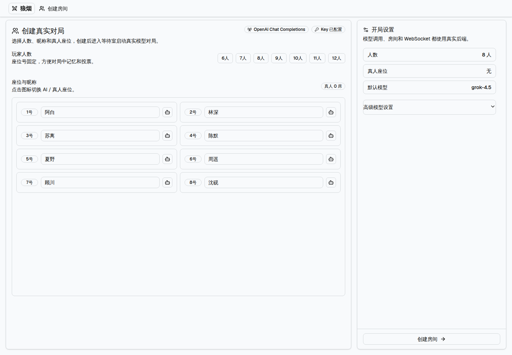
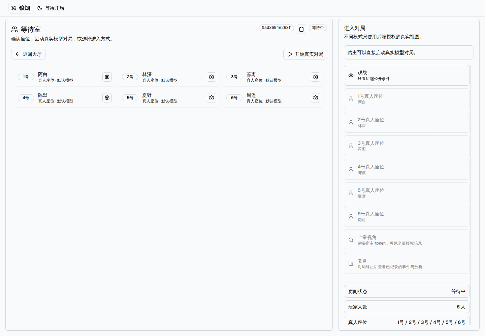
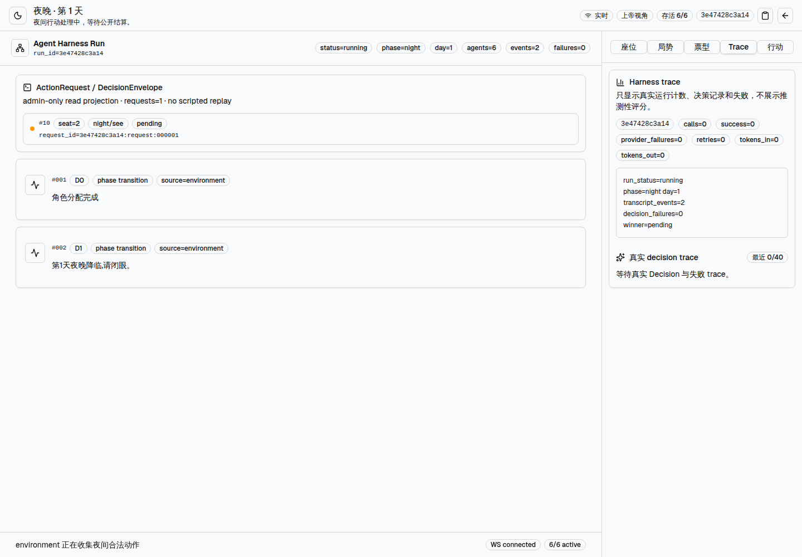
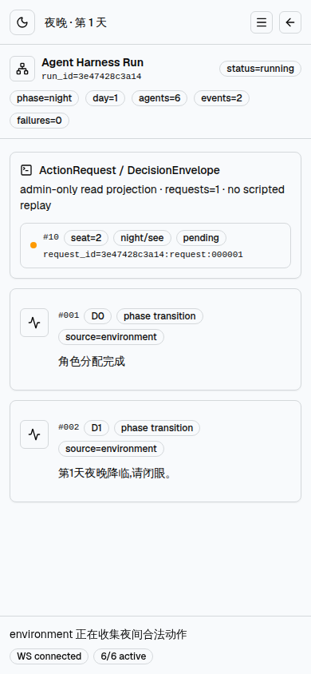

# Werewolf Agent Harness

[](https://github.com/multi-zhangyang/werewolf-agent-harness/actions/workflows/ci.yml)
[](https://www.python.org/)
[](https://nodejs.org/)

面向隐藏身份博弈、多人 Agent 对抗实验和可审计模型评估的生产级 Harness。项目的基本单位是“一名玩家，一个持续存在的 Agent”：每个席位拥有独立记忆、角色信念、策略、伪装计划和工具调用边界；规则由确定性环境执行，模型只负责在合法动作中做选择。

这不是一个中央 Agent 代替所有玩家，也不是把多个角色提示词包装成聊天机器人。每个 Agent 可以为了阵营目标进行合法的隐瞒、误导和身份伪装，但不能改写环境事实、越权读取信息或让系统替它补发言和改投。

## 产品界面

以下截图来自真实的 FastAPI + React production build，而非概念图。

### 创建真实对局



### 等待室



### God Console

桌面端：



移动端：



## 适用场景

- 隐藏身份博弈与社会推理实验
- 多 Agent 协作、竞争和欺骗策略研究
- 真人与模型混合席位的对局产品
- 带完整事件、工具调用和权限投影的模型评测
- 需要回放、复核和离线重算的研究或运营系统

## 核心能力

| 能力 | 说明 |
| --- | --- |
| 一人一 Agent | 每个座位绑定独立 `AgentActor`、Memory、PrivateAgentState 和 RNG，构造器拒绝复用或错绑。 |
| 合法欺骗 | Agent 可公开发表与私有信念不同的身份声明；RulesEngine 只校验协议与动作合法性，不替 Agent 判断“该不该撒谎”。 |
| 工具优先决策 | 模型通过标准 tool-calling 选择动作；系统不把普通聊天文本当作行动，也不在结束后伪造流式输出。 |
| 确定性环境 | Environment/RulesEngine 负责观察、合法动作、权限、结算、超时和事实记录。 |
| 多级可见性 | 支持 public、seat-private、team-private、god 和 admin trace 投影，私有 reasoning 不进入公共事件流。 |
| 可审计证据 | 每个请求只有一个终态；Transcript、manifest、summary 三件套可脱离进程校验完整性。 |
| 实时控制台 | React Console 通过 REST/WebSocket 展示事件、ActionRequest、DecisionEnvelope、规则结算、失败和授权范围内的 trace。 |
| 标准模型协议 | 通用支持 OpenAI-compatible Chat Completions、OpenAI Responses 和 Anthropic Messages，不按供应商或模型名称写隐藏分支。 |

## 产品流程

```text
创建房间 → 配置席位 → 启动对局 → REST/WebSocket 实时事件
       → 观战 / 真人行动 / God Console → 终局 → Replay 与离线验证
```

每个生产决策遵循同一条不可绕过的链路：

```text
Environment
  → ActionRequest(observation, legal_actions, deadline)
  → DecisionRuntime
  → AgentProtocol.decide(request)
  → DecisionEnvelope 或结构化失败
  → protocol validation
  → RulesEngine
  → immutable Transcript
```

关键保证：已接受的请求恰好产生一个终态；非法目标不会被偷偷改成另一个目标；模型失败、真人超时和 phase deadline 都会留下可审计失败；`SKIP` 只表示 Agent 明确选择跳过。狼人夜间协调先逐席产生私密消息，再让每只狼在看到同阵营消息后独立提交最终行动，不存在统一控制狼队的中央 Agent。

## v1.0 完成度

当前 **v1.0 发布范围完成度为 100%**。这表示已声明的 v1.0 功能、质量门禁、真实模型调用、浏览器路径和安全边界均有代码与验证证据；不表示未来永远没有未知缺陷，也不表示下列明确不在 v1.0 范围内的能力已经实现：

- interactive API 的多 worker 分布式协调
- 从 Web UI 选择任意多环境（Cipher Council 可通过 Core CLI 和离线 artifact 运行）
- 独立的心理真值或“欺骗质量”裁判模型
- 除 `classic.v1` 之外的 Werewolf 规则变体
- 外部模型的完全确定性复现

质量门禁明细见 [`docs/QUALITY_GATES.md`](docs/QUALITY_GATES.md)。

## 架构

```text
React Console
      │ REST / WebSocket
      ▼
FastAPI RoomManager ── capability / persistence / replay
      │
      ▼
Environment + RulesEngine ── facts / legal actions / resolution
      │ ActionRequest
      ▼
Independent AgentActor per seat
      │ standard tool-calling Router
      ▼
OpenAI-compatible / Responses / Anthropic provider
```

Harness 与模型之间只有标准协议边界。共享的 `LLMRouter` 只复用无会话网络传输、重试预算和成本统计，不共享 Agent 的记忆或思考。管理员可以在授权的 God Console 中查看经过长度和递归脱敏限制的私有 trace；其他 Agent、玩家和公共观众看不到这些内容。

## 快速开始

环境要求：Python 3.12+、Node.js 20+。

```bash
git clone https://github.com/multi-zhangyang/werewolf-agent-harness.git
cd werewolf-agent-harness

python3 -m venv .venv
source .venv/bin/activate
pip install -r requirements.lock

cd frontend
npm ci
cd ..
```

只读取 `WEREWOLF_*` 配置，不会回退读取进程中的通用 API key：

```bash
export WEREWOLF_LLM_PROVIDER=openai
export WEREWOLF_LLM_API_BASE=https://your-compatible-gateway.example/v1
export WEREWOLF_LLM_API_KEY=replace-locally
export WEREWOLF_LLM_MODEL=your-model-id
export WEREWOLF_LLM_RESPONSE_FORMAT='{"type":"json_object"}'
```

密钥只放在本地环境或密钥管理系统中。不要将 `.env`、API key、token、完整私有 trace 或含凭据的 artifact 提交到 Git、截图、日志或 issue。配置模板见 [`.env.example`](.env.example)。

### 开发模式

```bash
# 终端 1
source .venv/bin/activate
python -m src.api.server

# 终端 2
cd frontend
npm run dev
```

访问 `http://localhost:5173`。Vite 会将 `/api` 和 `/ws` 转发到后端。

### 生产式本地运行

```bash
cd frontend && npm run build && cd ..
python -m src.api.server
```

访问 `http://localhost:8000`。默认 CORS 已覆盖同源本地 API 端口；公网部署时请显式设置精确的 `WEREWOLF_CORS_ORIGINS`，并在反向代理层配置 TLS、身份认证、限流、费用上限和脱敏日志策略。

### Core Harness 与真实模型

通用 Core runner 通过标准 tool-calling 运行非 Werewolf environment，例如：

```bash
python -m src.harness.core_cli \
  --environment council.cipher@2 \
  --model "$WEREWOLF_LLM_MODEL" \
  --artifact-root artifacts
```

真实 provider 验证使用同一套通用 Router，不为任何供应商或模型增加特殊适配。最近一次低并发 `council.cipher@2` 验证结果：15 次 provider 调用、15 次成功、0 次失败、0 次重试；15 个请求/终态、15 个工具调用/结果和 15 个环境消费全部配对；5 个独立 `CoreToolActor`；Cipher 私密协调的 2 条消息通过 message barrier 与 observation isolation 校验。真实运行产物不会随仓库提交，发布时应通过脱敏 artifact 或签名发布资产绑定到对应 revision。

## 验证与质量门禁

```bash
# 后端完整测试 + 前端类型检查/生产构建
make test

# 仅构建前端（npm run build 同时执行 tsc -b）
make build-ui

# 浏览器旅程（需要本地启动 API/UI）
make test-browser

# 对已生成的脱敏 artifact 做离线校验
python -m src.harness.smoke artifacts/<run-dir>
```

CI 在 Node 20 和锁定依赖下执行后端测试、前端检查/构建、浏览器测试和敏感信息扫描。真实 API 调用是 opt-in 的，不会在 CI 中读取或请求任何真实密钥。

## 安全边界

- 凭据只在进程内存中使用，不进入 RunSpec、manifest、transcript、summary、URL、浏览器 storage 或公共 projection。
- WebSocket 使用 capability subprotocol 和严格 Origin 白名单；不要在公网使用查询参数 token。
- `thought`/`reasoning` 只属于授权 admin trace，经过递归脱敏与长度/深度限制。
- 当前 interactive API 是 single-worker。多 worker 需要外部共享状态、锁、pub/sub、分布式计数器和可信代理策略。
- 生产环境应启用 TLS、用户认证、房间容量/TTL、provider rate limit、花费上限、审计日志保留策略和健康检查。

## 目录结构

```text
src/
  api/          FastAPI 房间、REST、WebSocket 与 capability
  agents/       AgentActor、CoreToolActor、memory 与协议
  environments/ Werewolf / Cipher Council environment
  harness/      Router、runner、artifact、smoke、CLI
  game/         classic.v1 规则、角色牌组与结算
frontend/       React + Vite Harness Console
tests/          协议、隔离、规则、API、浏览器与 adversarial tests
docs/           质量门禁、部署说明和真实 UI 截图
```

## 贡献与许可

提交代码前请运行 `make test`、前端 `npm run build` 和 `git diff --check`。涉及可见性、请求终态、规则结算或 artifact 的改动必须补充相应回归测试，并在质量门禁中更新证据。

仓库当前未附加独立开源许可证文件；在商业分发或外部贡献前，请先补充适用的 LICENSE 和贡献协议。
